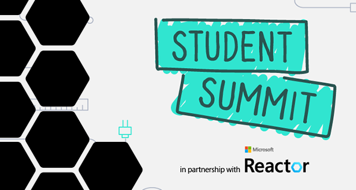

<head>
  <meta name="twitter:url" content="https://www.azurestaticwebapps.dev/blog/roundup-2022-oct" />
  <meta name="twitter:title" content="This Month in Azure Static Web Apps: Oct 2022" />
  <meta name="twitter:description" content="This October in @AzureStaticApps - we cover hybrid rendering with @nextjs, universal rendering with @nuxt_js and put the spotlight on #MicrosoftStudentSummit" />
  <meta name="twitter:image" content="https://www.azurestaticwebapps.dev/img/png/roundup/oct.png" />
  <meta name="twitter:card" content="summary_large_image" />
  <meta name="twitter:creator" content="@nitya" />
  <meta name="twitter:site" content="@AzureStaticApps" /> 
  <link rel="canonical" href="https://www.azurestaticwebapps.dev/blog/roundup-2022-oct" />
</head>

来了！！我们的十月**本月聚焦SWA**特辑 🎉

:::info[关于特辑 ]

本特辑传统上在**每月最后一个周一**发布——恰逢每月最后一个周三举行的[**Azure静态Web应用社区站会**](https://www.youtube.com/playlist?list=PLI7iePan8aH7Yo8vo288dAULgjyCCCcEJ)前夕。您可以通过这篇友好的博客文章了解所有新闻和公告，然后加入直播参与互动讨论、演示等环节。

 * 不想错过下期特辑？<a href="/thismonth/rss.xml" target="_blank">**订阅Feed**</a>。
 * 想投稿？[**提交此定制issue**](https://github.com/staticwebdev/30DaysOfSWA/issues/new?assignees=&labels=ThisMonthIn+-+Community&template=---this-month-in-swa--community-submission.md&title=This+Month+In%3A+Community)。
 * 想回顾往期内容？[**浏览历史版本**](/roundup#roundups-archive)。
 * 想观看往期直播？[**查看站会录像**](https://aka.ms/swa/community/standups)

别忘了提交_您的_动态以便纳入下期特辑！

:::

---

---

## 产品动态

_本节涵盖产品团队的最新新闻或公告。阅读了解Azure静态Web应用领域的最新动态！_

* **10月3日** | [Nuxt 3与Azure静态Web应用的通用渲染](https://techcommunity.microsoft.com/t5/apps-on-azure-blog/universal-rendering-with-nuxt-3-and-azure-static-web-apps/ba-p/3586297?WT.mc_id=javascript-74011-ninarasi)。此前，您可以在Azure静态Web应用上部署静态渲染的Nuxt应用，整个应用会预生成静态内容。而Nuxt 3还支持通用渲染，在保持客户端交互能力的同时，提供服务器端渲染的性能和搜索引擎优化优势。[**立即开始**](https://learn.microsoft.com/en-us/azure/static-web-apps/deploy-nuxtjs?WT.mc_id=javascript-74011-ninarasi)学习本教程。

* **10月8日** | [扩展Azure静态Web应用中的Next.js支持](https://techcommunity.microsoft.com/t5/apps-on-azure-blog/extending-next-js-support-in-azure-static-web-apps/ba-p/3627975?WT.mc_id=javascript-74011-ninarasi)   重磅来袭——Azure静态Web应用现已**预览**支持混合Next.js应用，通过支持服务器端渲染、增量静态再生（SSR和ISR）、API路由、高级图像压缩和Next.js身份验证，使Next.js的零配置部署更加简单。[**立即开始**](https://learn.microsoft.com/en-us/azure/static-web-apps/deploy-nextjs-hybrid?WT.mc_id=javascript-74011-ninarasi)学习本教程。

---

## 开发者资源

_本节涵盖来自微软作者的内容、活动和代码示例。查看相关学习资源和最佳实践。_

* **10月13日** | [Azure上的云原生架构：Microsoft Ignite更新](https://techcommunity.microsoft.com/t5/apps-on-azure-blog/cloud-native-architectures-on-azure-microsoft-ignite-update/ba-p/3650098?WT.mc_id=javascript-74011-ninarasi)   阅读本文了解Azure Static Web Apps在构建Azure无服务器解决方案的云原生生态中的定位。然后[观看该会议](https://ignite.microsoft.com/sessions/8950b2b1-62eb-48f9-90ef-5ad779ce8e22?source=sessions?WT.mc_id=javascript-74011-ninarasi)，查看Next.js混合渲染预览版的演示，并了解Azure Static Web Apps的未来发展。

* **10月24日** | [使用Next.js和Azure Static Web Apps创建极速Web应用](https://www.youtube.com/watch?v=w6uH1CZEhcg&WT.mc_id=javascript-74011-ninarasi)   在这段**5分钟视频教程**中，探索Azure Static Web Apps对Next.js混合渲染的支持如何帮助您创建针对SEO和性能优化的Web应用程序。这是[Azure技巧与窍门：Static Web Apps](https://www.youtube.com/playlist?list=PLlrxD0HtieHgMPeBaDQFx9yNuFxx6S1VG&WT.mc_id=javascript-74011-ninarasi)20部分系列的一部分，带您从核心概念到最佳实践。

---

## 社区动态

:::info[由像您一样的开发者创作！]
_本节重点介绍来自我们优秀开发者社区的内容——直接提交或在Tech Community和dev.to等相关标签下发布的内容。_
:::

* **10月3日** | Microsoft MVP Stacy Cashmore刚刚出版了一本关于[Azure Static Web Apps入门](https://link.springer.com/book/10.1007/978-1-4842-8146-8)的书籍，重点介绍了“使用Blazor构建和部署动态Web应用程序”。书中涵盖了使用Azure Functions的动态内容，讨论了JAMstack革命，并包含使用Visual Studio 2022构建的示例。您可以在[Stacy的推文](https://twitter.com/Stacy_Cash/status/1576956491218976768)中找到更多详情。

---

## 即将举行的活动

_本节重点介绍可能包含Azure Static Web Apps内容或开发者对话的线上或线下活动——欢迎提交CFP或注册链接！_

* **10月27日** | 加入MVP Stacy Cashmore在[Microsoft Reactor](https://reactor.microsoft.com/en-us/reactor/events/17239/)的活动，体验**从零到部署应用仅需60分钟**。
* **11月8-10日** | 注册参加[_.NET Conf 2022_](https://www.dotnetconf.net/)，并参加**使用Blazor和.NET的Azure Static Web Apps**的会议。
* **11月9-10日** | 注册参加[GitHub Universe](https://githubuniverse.com/)，并关注来自[Microsoft演讲者](https://githubuniverse.com/events/detail/speakers)的精彩会议！

---

## 您知道吗？

_每个月，我们希望聚焦一个在Azure Static Web Apps背景下值得了解的关键资源或个人。_

:::info[🌟 聚焦：微软学生峰会]
您知道吗？[微软学生峰会](https://developer.microsoft.com/en-us/reactor/overview/student-summit-2022?WT.mc_id=javascript-74011-ninarasi)已于**2022年10月7日**作为全球虚拟活动成功举办。该活动根据不同地区的时区和社区兴趣，在多个区域以线上形式举行。

您可以通过[**此便捷播放列表**](https://www.youtube.com/playlist?list=PLmsFUfdnGr3zU8GBuF3772MWhO4mMjMA-?WT.mc_id=javascript-74011-ninarasi)观看所有分会场的录制内容。

:::

Azure Static Web Apps是学生观众关注的重点，在7个区域活动中有6个安排了相关主题的专场。以下是相关录制的链接：

* 北美地区（Thomas和Ricardo）- [观看录制](https://youtu.be/_rfVNPWdcNg?t=7505)
 * 欧洲、中东和非洲地区（Sandro）- [观看录制](https://www.youtube.com/watch?v=TLJvG98pSkc&list=PLmsFUfdnGr3zU8GBuF3772MWhO4mMjMA-&index=4&t=7168s&WT.mc_id=javascript-74011-ninarasi)
 * 印度地区（Reshmi）- [观看录制](https://youtu.be/e7tm1WpFK24?t=8750&WT.mc_id=javascript-74011-ninarasi)
 * 亚太地区（Julia）- [观看录制](https://youtu.be/ZjHZ5zCGPbk?t=8528&WT.mc_id=javascript-74011-ninarasi)
 * 巴西地区（Lavinia）- [观看录制](https://youtu.be/NmjwsCExIQM?list=PLmsFUfdnGr3zU8GBuF3772MWhO4mMjMA-&t=7892&WT.mc_id=javascript-74011-ninarasi)
 * 拉丁美洲地区（Christopher和Francisco）- [观看录制](https://youtu.be/ROJFLILoJ9U?list=PLmsFUfdnGr3zU8GBuF3772MWhO4mMjMA-&t=6930&WT.mc_id=javascript-74011-ninarasi)

微软学生大使还参与了[Static Web Apps Bug Bash 🐞](https://github.com/microsoft/studentambassadors/issues)活动，通过实践获得了提供宝贵产品反馈的经验，并与产品团队合作解决已发现的问题！[**了解更多关于微软学生大使计划的信息**](https://studentambassadors.microsoft.com/?WT.mc_id=javascript-74011-ninarasi)

---

## 🚨 | 内容征集

:::tip[下一期汇总：2022年11月30日]
投稿截止日期为2022年11月23日。

 * 您是否撰写过文章、创建过SWA应用或示例？
 * 您是否在组织包含SWA相关内容的会议？
 * 您是否是刚完成首个SWA应用或博客的学生？

请尽快[**通过此定制问题提交详情**](https://github.com/staticwebdev/30DaysOfSWA/issues/new?assignees=&labels=ThisMonthIn+-+Community&template=---this-month-in-swa--community-submission.md&title=This+Month+In%3A+Community)。我们期待分享您的贡献！
:::