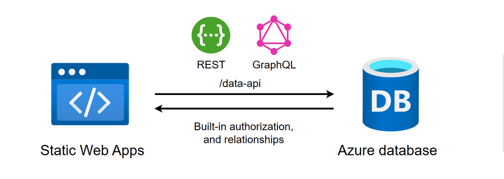

<head>
  <meta name="twitter:url" content="https://www.azurestaticwebapps.dev/blog/roundup-2023-mar" />
  <meta name="twitter:title" content="This Month in Azure Static Web Apps: March 2023" />
  <meta name="twitter:description" content="This March in @AzureStaticApps - we cover Azure Static Web Apps Diagnostics, authentication, deploying from Codespaces and SWA CLI" />
  <meta name="twitter:image" content="https://www.azurestaticwebapps.dev/img/png/roundup/mar.png" />
  <meta name="twitter:card" content="summary_large_image" />
  <meta name="twitter:creator" content="@saragibby" />
  <meta name="twitter:site" content="@AzureStaticApps" /> 
  <link rel="canonical" href="https://www.azurestaticwebapps.dev/thismonth/roundup-2023-mar" />
</head>

欢迎查阅 **2023年3月** 的 **Azure静态Web应用月度简报** 🎉

:::info[关于本简报]

本简报传统上于**每月第四个星期一**发布——恰在[**Azure静态Web应用社区站会**](https://aka.ms/swa/community/standups)（每月第四个星期四举行）之前。您可以通过这篇友好的博客文章了解所有新闻和公告，然后加入直播参与互动讨论、演示等。

 * 不想错过下一期简报？<a href="/thismonth/rss.xml" target="_blank">**订阅Feed**</a>。
 * 想为简报投稿？[**提交此定制issue**](https://github.com/staticwebdev/30DaysOfSWA/issues/new?assignees=&labels=ThisMonthIn+-+Community&template=---this-month-in-swa--community-submission.md&title=This+Month+In%3A+Community)。
 * 想回顾往期内容？[**浏览往期文章**](/roundup#roundups-archive)。
 * 想观看往期直播？[**查看站会录像**](https://aka.ms/swa/community/standups)

别忘了提交您的更新以纳入下一期！

:::

---

---

## 产品动态

_本节涵盖产品团队的最新新闻或公告。阅读以下内容，了解Azure静态Web应用的最新动态！_

> 🌟 **数据库连接** 现已可用！🌟 
> 所有资源请见我们的[数据库连接：内容集锦](/collections/dab)

* **3月15日** | [公共预览：Azure静态Web应用支持A记录](https://azure.microsoft.com/en-us/updates/public-preview-azure-static-web-apps-support-for-a-record/) Azure静态Web应用引入了添加APEX自定义域（使用`A`记录）的功能，以支持不支持`ALIAS`记录、`ANAME`记录和`CNAME`扁平化的域名注册商。| _**[详情请阅读！](https://aka.ms/swa/arecords)**_
* **3月15日** | [公共预览：Azure静态Web应用中的数据库连接支持](https://azure.microsoft.com/en-us/updates/public-preview-database-connections-support-in-azure-static-web-apps/) Azure静态Web应用引入了通过Data API Builder实现的数据库连接。现在，您可以直接从前端客户端应用程序访问Azure数据库内容，无需编写后端代码。通过内置的`/data-api`端点发起REST和GraphQL请求，安全地检索和修改数据库内容。| _**[了解更多并立即开始！](https://aka.ms/swa/database-connections)**_
* **3月15日** | [公共预览：Data API Builder为现代数据库即时创建REST和GraphQL端点](https://azure.microsoft.com/en-us/updates/public-preview-data-api-builder-instantly-creates-modern-rest-and-graphql-endpoints-for-modern-databases/) 通过Data API Builder，数据库对象可以通过REST或GraphQL端点暴露，使您的数据能够在任何平台、任何语言和任何设备上使用现代技术访问。| _**[Data API Builder作为开源项目提供于此](https://aka.ms/dab)**_

---

## 开发者资源

_本节涵盖来自Microsoft作者的内容、活动和代码示例。查看相关学习资源和最佳实践。_

* **3月7日** | `techcommunity.microsoft.com` - [**取消链接Azure静态Web应用后Azure函数应用无法工作**](https://techcommunity.microsoft.com/t5/apps-on-azure-blog/azure-function-app-doesn-t-work-after-unlinking-to-azure-static/ba-p/3759599) 作者：_Tony Ju_。将现有Azure函数应用链接到Azure静态Web应用时，函数会被映射到静态Web应用的/api路由，但若在静态Web应用外部访问该函数应用，则会报错。本文逐步指导如何更新函数应用的认证设置以兼容两种场景。
* **3月16日** | `youtube.com` - [**直接从静态Web应用连接数据库**](https://youtu.be/vGOnh0UrADg) 作者：_Thomas Gauvin_。了解如何将Azure SQL数据库连接到静态Web应用，并通过自动生成的安数据终结点进行访问。视频演示了如何建立连接，并使用REST API对数据执行增删改查(CRUD)操作。
* **3月16日** | `youtube.com` - [**使用GraphQL从静态Web应用查询数据库**](https://youtu.be/NF0EC68rdQk) 作者：_Craig Shoemaker_。学习如何通过Azure静态Web应用的数据库连接功能，使用GraphQL直接查询数据库而无需编写后端代码。视频展示了如何配置该功能并在应用中使用GraphQL查询。
* **3月16日** | `techcommunity.microsoft.com` - [**Azure上的GraphQL：第13部分 - 在SWA和React中使用Data API构建器**](https://techcommunity.microsoft.com/t5/apps-on-azure-blog/graphql-on-azure-part-13-using-data-api-builder-with-swa-and/ba-p/3769309) 作者：_Aaron Powell_。本教程将逐步指导如何创建React应用，通过数据库连接功能使用GraphQL从Cosmos DB获取数据！

---

## 社区动态

:::info[开发者原创内容]
_本节重点呈现来自开发者社区的优质内容——通过直接提交或在Tech Community、dev.to等平台使用Azure静态Web应用标签发现的资源。_
:::

* **3月13日** | `dev.to` - [**Astro与Azure静态Web应用**](https://dev.to/florianrappl/astro-and-azure-static-web-apps-efl) 作者：_Florian Rappl_。本文解析Astro框架的特性及其在信息驱动型静态网站中的优势，探讨将Azure SWA作为托管方案的注意事项，并演示如何部署Astro站点。
* **3月10日** | `geeksforgeeks.org` - [**如何使用Azure静态Web应用部署Angular应用**](https://www.geeksforgeeks.org/how-to-use-azure-static-web-apps-to-deploy-an-angular-app/) 作者：_Manikandan Shanmugam_。本分步指南说明如何仅凭GitHub和Azure账户创建Angular应用并部署至Azure静态Web应用。
* **3月20日** | `blog.johnnyreilly.com` - [**Playwright、GitHub Actions与Azure静态Web应用预发布环境**](https://blog.johnnyreilly.com/playwright-github-actions-and-azure-static-web-apps-staging-environments) 作者：_John Reilly_。Azure静态Web应用的预发布环境支持在生产前测试变更。本文演示如何通过GitHub Actions对预发布环境运行Playwright测试。

---

## 近期活动

_本节推荐可能包含Azure静态Web应用相关内容或开发者讨论的线上线下活动——欢迎提交活动征集(CFP)或注册链接！_

* **3月23日** | ✨ **加入[Azure静态Web应用社区站会](https://www.youtube.com/live/9O4qZ6VHOIA?feature=share)直播** ✨ 与Azure静态Web应用团队成员一起了解最新动态、演示和公告（美国东部时间中午12点）。
* **3月20-24日** | [**微软学生峰会**](https://aka.ms/StudentSummit) 免费注册参加这场90分钟的职业发展活动！可观看直播或活动结束后的点播内容，并关注您所在地区的峰会后续技能提升活动。
* **4月5日** | [**Azure开发者 - .NET日**](https://learn.microsoft.com/events/learn-events/azuredeveloper-dotnetday/) 加入我们，探索Azure专为.NET开发者设计的最新服务和功能。您将学习前沿的云开发技术，这些技术可以节省您的时间和成本，同时为客户提供最佳体验。
* **4月26日** | [**VS Code日2023**](https://learn.microsoft.com/events/learn-events/vs-code-day-2023/) 我们的年度活动，您将了解如何使用VS Code的最新和最强大功能提升开发工作流程。
* **5月23-24日** | [**微软Build大会**](https://build.microsoft.com/home) 通过专注于云和AI、.NET、数据和分析、开发工具、DevSecOps和SRE、低代码等领域的深度互动会议，提升您的知识和技能。[立即注册](https://register.build.microsoft.com/)参加在西雅图现场或全球任何地方的远程活动。

---

## 您知道吗？

_每个月，我们希望聚焦一个在Azure静态Web应用背景下值得了解的关键资源或个人。_

:::info[🌟 聚焦：数据库连接]

上周我们宣布了[**Azure静态Web应用的数据库连接**](https://aka.ms/swa/db/announcement)的发布 🥳

这一新功能允许您使用REST和GraphQL访问Azure数据库，而无需编写后端代码！一旦您在Web应用程序和数据库之间建立连接，您就可以操作数据，支持完整的CRUD操作、内置授权和关系。

:::

想了解更多？我们已经为您准备好了！网站现已更新了“集合”部分，您可以找到许多主题的资源链接。查看我们的[**数据库连接：内容集合**](/collections/dab)，其中包含了关于数据库连接的所有必要内容。

或者，这里有一些链接可以帮助您立即开始数据库连接：

* [免费开始，将数据库连接到您的静态Web应用资源](https://aka.ms/swa/db/getstarted)
* [了解更多关于静态Web应用的数据库连接](https://aka.ms/swa/db/docs)

如果您有反馈和想法，我们非常乐意听取！加入[**GitHub数据库连接讨论**](https://github.com/Azure/static-web-apps/discussions/1111)与我们分享。

---

## 🚨 | 内容征集

:::tip[下一期汇总：2023年4月24日]
提交截止日期为2023年4月19日。

 * 您是否撰写了一篇文章，创建了一个SWA应用程序或示例？
 * 您是否正在组织一个包含SWA相关会话的活动？
 * 您是否是刚刚创建了第一个SWA应用程序或博客文章的学生？

尽快[**使用此自定义问题**](https://github.com/staticwebdev/30DaysOfSWA/issues/new?assignees=&labels=ThisMonthIn+-+Community&template=---this-month-in-swa--community-submission.md&title=This+Month+In%3A+Community)提交详细信息。我们迫不及待地想分享您的贡献！
:::