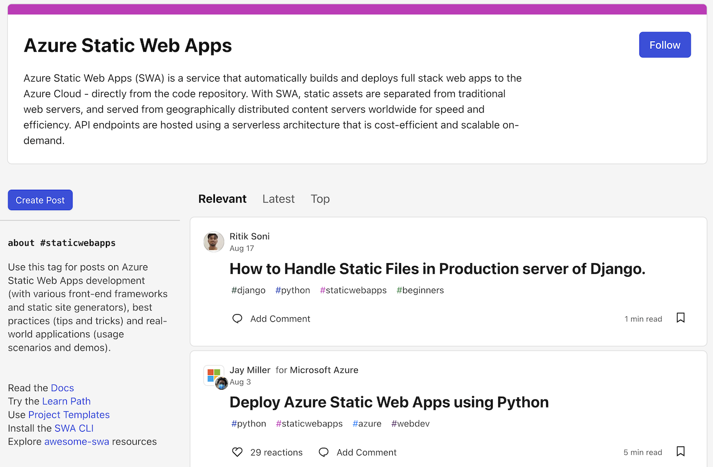

<head>
  <meta name="twitter:url" content="https://www.azurestaticwebapps.dev/blog/roundup-2022-aug" />
  <meta name="twitter:title" content="This Month in Azure Static Web Apps: Aug 2022" />
  <meta name="twitter:description" content="A monthly roundup of news, articles, events and more - on Azure Static Web Apps" />
  <meta name="twitter:image" content="https://www.azurestaticwebapps.dev/img/png/roundup/aug.png" />
  <meta name="twitter:card" content="summary_large_image" />
  <meta name="twitter:creator" content="@nitya" />
  <meta name="twitter:site" content="@AzureStaticApps" /> 
  <link rel="canonical" href="https://www.azurestaticwebapps.dev/blog/roundup-2022-aug" />
</head>

重磅来袭！！首期《SWA月度精选》🎉

每月最后一个星期三，我们都会在本博客发布Azure静态Web应用的产品动态、活动资讯和内容更新汇总。我们期待这份精选能逐步成为您一站式获取SWA生态圈所有精彩内容的友好渠道。

* 不想错过更新？<a href="/blog/rss.xml" target="_blank">**订阅RSS源**</a>。
 * 想要投稿？[**提交此定制issue**](https://github.com/staticwebdev/30DaysOfSWA/issues/new?assignees=&labels=ThisMonthIn+-+Community&template=---this-month-in-swa--community-submission.md&title=This+Month+In%3A+Community)。
 * 查看往期内容？[**浏览历史版本**](/thismonth#view-past-editions)

---

---

## 产品动态

_本节涵盖产品团队的最新公告。了解Azure静态Web应用的最新进展！_

* **6月22日** | [Azure SWA现支持更多API选项](https://azure.microsoft.com/en-us/updates/public-preview-new-api-backend-options-in-azure-static-web-apps/) 现在可将Azure应用服务、Azure容器应用和Azure API管理服务无缝链接至SWA的API端点。查阅[文档](https://docs.microsoft.com/en-us/azure/static-web-apps/apis-overview)并体验[示例教程](https://techcommunity.microsoft.com/t5/apps-on-azure-blog/new-api-backend-options-in-azure-static-web-apps/ba-p/3516882)。

* **6月8日** | [静态Web应用CLI正式发布](https://azure.microsoft.com/en-us/updates/static-web-apps-cli-now-available/)。 五月底发布的v1.0版本新增了`swa init`、`swa login`和`swa deploy`等命令，打造了本地SWA开发的全能工具。[_查看文档_](https://azure.github.io/static-web-apps-cli/)

随时访问[**Azure更新中心**](https://azure.microsoft.com/en-us/updates/?query=static%20web%20apps)获取最新动态。

---

## 开发资源

_本节汇集微软官方技术文章、活动与代码示例。获取相关学习资源与最佳实践。_

* **8月3日** | `dev.to` - [**使用Python部署Azure静态Web应用**](https://dev.to/azure/deploy-azure-static-web-apps-using-python-1hn7) by _Jay Miller_。Python开发者想探索Azure静态Web应用？本文手把手教您从VS Code配置部署首个Python版SWA。

* **7月22日** | `TechCommunity` - [**免费在Azure静态Web应用上托管网站**](https://techcommunity.microsoft.com/t5/educator-developer-blog/host-your-website-on-azure-static-web-apps-for-free/ba-p/3579709?WT.mc_id=academic-74011-sagibbon) by _Julia Muiruri_。学生用户可通过Azure学生账户快速部署首个网站！

* **7月20日** | `dev.to` -[**进阶SWA DevOps流水线实践**](https://dev.to/azure/taking-a-swa-devops-pipeline-to-the-next-level-5co3) by _Aaron Powell_。当默认的GitHub Actions自动化部署无法满足复杂CI/CD需求时，本文提供了定制化解决方案。

---

## 社区动态

:::info[由开发者共创！]
_本节重点展示来自开发者社区的精彩内容——包括直接提交的素材，或发布在Tech Community和dev.to等平台相关标签下的文章。_
:::

* **7月19日** | `techcommunity.com` - [**《Azure冒险》——测试学生Azure实践技能的RPG游戏**](https://techcommunity.microsoft.com/t5/educator-developer-blog/azure-adventure-a-rpg-game-to-test-student-s-azure-practical/ba-p/3576331?WT.mc_id=academic-74011-sagibbon) 作者：_香港专业教育学院信息技术系Wong Cyrus_。这款开源HTML5 RPG游戏基于最新版Azure自动评分引擎开发，并运用了静态Web应用技术。

---

## 近期活动

_本节重点推荐可能包含Azure静态Web应用内容或开发者交流的线上线下活动——欢迎提交活动征集或注册链接！_

* **2022年9月1-30日** | [无服务器九月](https://aka.ms/serverless-september) - 探索Azure无服务器技术
* **2022年10月7日** | [微软学生峰会](https://developer.microsoft.com/en-us/reactor/overview/student-summit-2022/) - 全球线上活动
* **2022年10月12-14日** | [微软Ignite大会](https://ignite.microsoft.com/en-US/home) - 线下（西雅图）与线上同步

---

## 您知道吗？

_每月我们将聚焦一个与Azure静态Web应用相关的关键资源或人物。_

:::info[🌟 本期聚焦：DEV.TO]
[Dev.to](https://dev.to)是一个包容性极强的开发者社区，您可以在此发布技术内容，以协作和学习为导向的方式进行交流。

 * 探索[**#staticwebapps**](https://dev.to/t/staticwebapps)标签——浏览约100篇相关文章
 * 发表评论或点赞——提供宝贵反馈！
 * 创建[**带标签的文章**](https://dev.to/new/staticwebapps)——分享您的学习成果
:::

这是该标签页的概览！**关注**标签即可在个人动态中获取文章——或通过[订阅RSS源](https://dev.to/feed/tag/staticwebapps)在阅读器查看。

> 

本期内容就是这些！欢迎告诉我们您对这种月度汇总新形式的看法！别忘了提交_您的_贡献内容。

---

## 🚨 | 内容征集

:::tip[下期截稿：2022年9月28日]
投稿截止日期：2022年9月25日

 * 您是否撰写了技术文章或创建了SWA应用/示例？
 * 您是否在筹备包含SWA相关议题的活动？
 * 您是否是刚完成首个SWA应用或博客的学生？

请立即通过[此专用issue](https://github.com/staticwebdev/30DaysOfSWA/issues/new?assignees=&labels=ThisMonthIn+-+Community&template=---this-month-in-swa--community-submission.md&title=This+Month+In%3A+Community)提交详情，我们期待分享您的成果！
:::